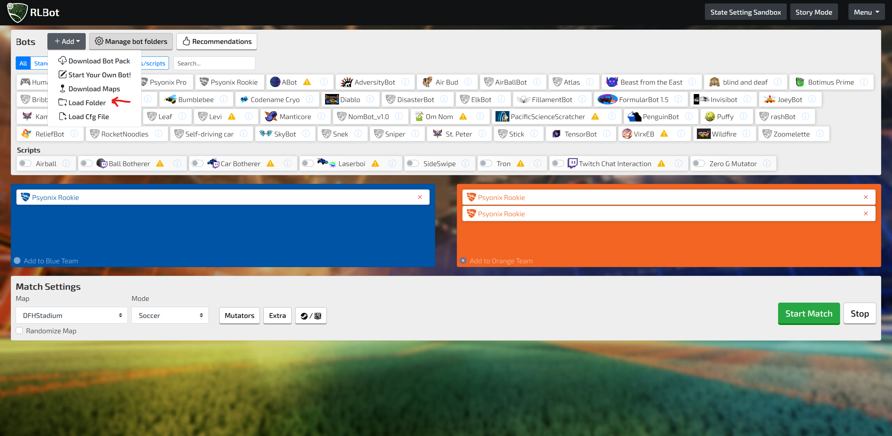
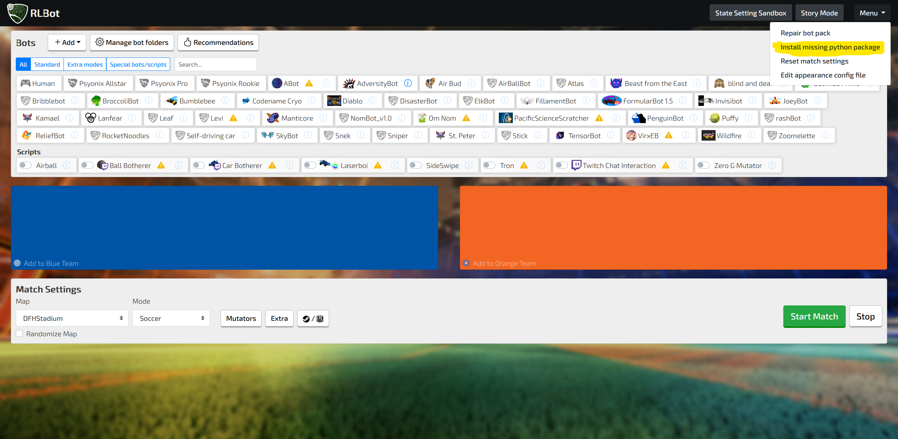
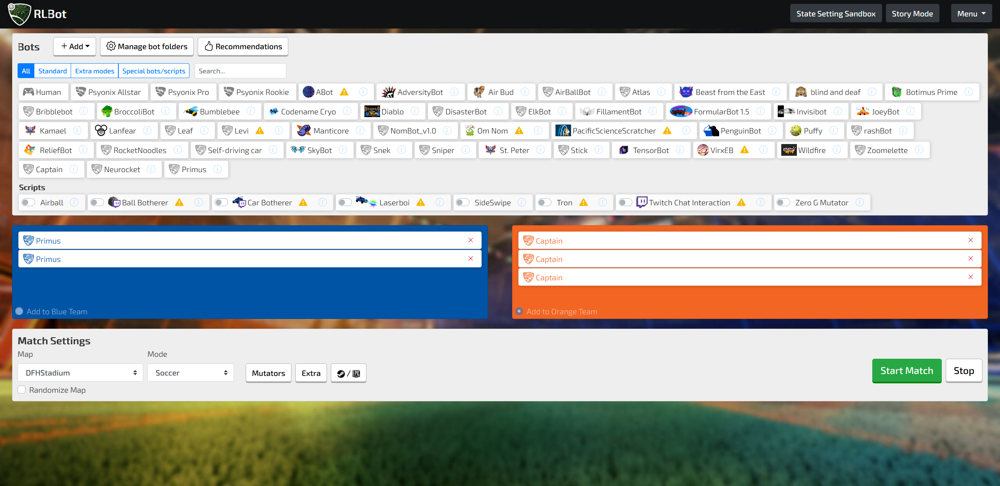
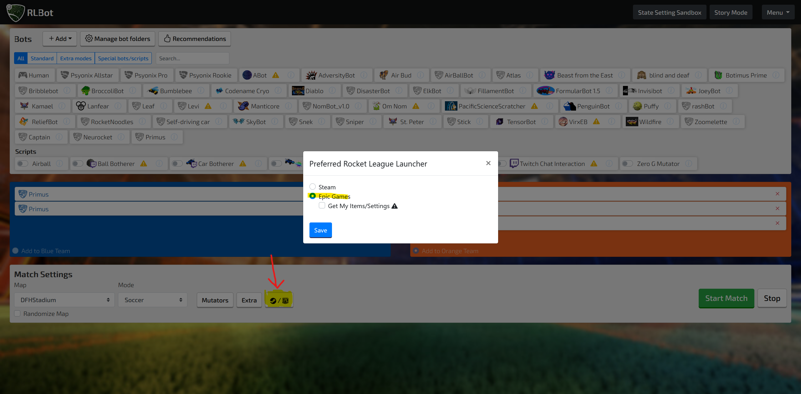
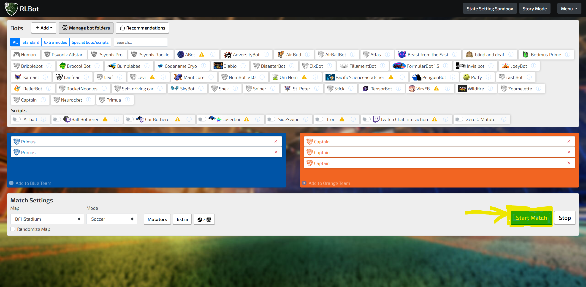

# rl_bots
Bots for Rocket League using RLBot - AASMA Project @ IST 2021

# Table of Contents
- [Project Structure](#project-structure)
  - [Primus](#primus)
  - [Capitão](#capitão)
  - [NeuRocket](#neurocket)
- [How to run](#how-to-run)
  - [Rocket League](#rocket-league)
  - [RLBot](#rlbot)

# Project Structure
Within this repository are 3 different bots, **Primus**, **Capitão** and **NeuRocket**. Each have a slightly different strucutre.

## Primus
Within Primus' folder, two sub folders can be found:
- **src** - Contains all of the bot's source code
- **training** - Contains training scenarios (used for testing and debugging the plays) made using RLBotTraining

The bot's main loop and implementation is written within the **src/bot.py** file. Within the utils folder, other modules developed for Primus can be found, such as the **src/utils/game_info** class, math/algebra functions within the **src/utils/math.py** and the intercept lookup tables and logic **src/intercept.py**.
The **src/plays** folder contains all of the individually developed plays (actions) that Primus can perform. Additionally, Primus' decision making flow is also within this folder inside the file **src/plays/strategy.py**. 

## Capitão
Capitão's folder structure is divided in modules with varying levels of granularity and function.
- **plays** - Contains the actions used by Capitão 
- **policy** - Contains the leader and marujo's decision making logic as well as macros. Leader decision making assigns stances (using macros) and marujo decision making converts macros to actions.
- **rlutilities, tools, util** - Contains utilities used for performing computations, `GameInfo` class and low-level super classes inherited by most RLBot agents.
- **training** - Contains exercises used to assess how Capitão handles particular situations.

Capitão's main code can be found in `Captain.py`. There it handles all the communication between its teammates, negotiates who the leader is, calls policy methods and, more importantly, return controls to the game at every game tick.

## NeuRocket
Neurocket has two main folders:
- **save** - Contains the saved models from training.
- **src**
  - **agent.py** - Contains the code for training the DQN and the `ReplayBuffer` to utilize [Experience Replay](https://arxiv.org/pdf/2007.06700.pdf).
  - **obs.py** - Contains the code that builds the state to use as input for the DQN from the game state.
  - **reward.py** - This where the reward function is defined.
  - **playing_agent.py** - A "playing" version of agent that doesn't have the code to train the network or to sometimes take random actions based on an *epsilon-greedy* strategy.
  - **bot.py** - This file is used by the RLBot Framework to run Neurocket. Here a `PlayingAgent` is created and used to choose actions.
  - **main.py** - This file is used for training in the [RLGym](https://rlgym.github.io/) environment by using an `Agent`.

# Links
## Showcase - https://www.youtube.com/watch?v=CNW3GA6i3XU
## Primus VS ReliefBot - https://www.youtube.com/watch?v=Y0trXzKRuYI
## Capitão VS Diablo - https://www.youtube.com/watch?v=yG4KzQlEAUc&t=75s

# How to run
A Windows OS is required since Rocket League does not run on Linux systems

## Rocket League
- Download and install the [Epic Games Launcher](https://www.epicgames.com/store/en-US/) (top right corner where it says `Get Epic Games`)
- Create an account or Log in
- Install [Rocket League](https://www.epicgames.com/store/en-US/p/rocket-league)
- After installing Rocket League open it once so it makes all the changes to the registry that may be required

## RLBot
- Download this Github repository as a .zip file ([Link](https://github.com/HerouFenix/rl_bots/archive/refs/heads/main.zip))
- Extract it
- Download and install [RLBot](http://rlbot.org/) 
    - [Direct Link](https://github.com/RLBot/RLBotGUI/releases/download/v1.0/RLBotGUI.msi)
    - [Tutorial video](https://www.youtube.com/watch?v=oXkbizklI2U)
- Run the GUI
    - A desktop shortcut may have been created otherwise go to `%installation directory%/RLBotGUI/RLBotGUIX.exe`
- Add the bots to the RLBot Framework by adding the root folder of the .zip file that was extracted
    
- Install the required dependencies
    
    - rlgym
    - tensorflow
    - tmcp
    - numpy
    - If you think nothing is happening check the command-line opened by the RLBotGUI to see if there are any errors
- Drag the bots to the respective teams

- Set Epic Games as the preferred launcher

- Start the game! After a bit Rocket League should load with the bots in play and you in spectator mode!
  - If some agents seem to not move check the command-line opened by the RLBotGUI to see if there are any errors

